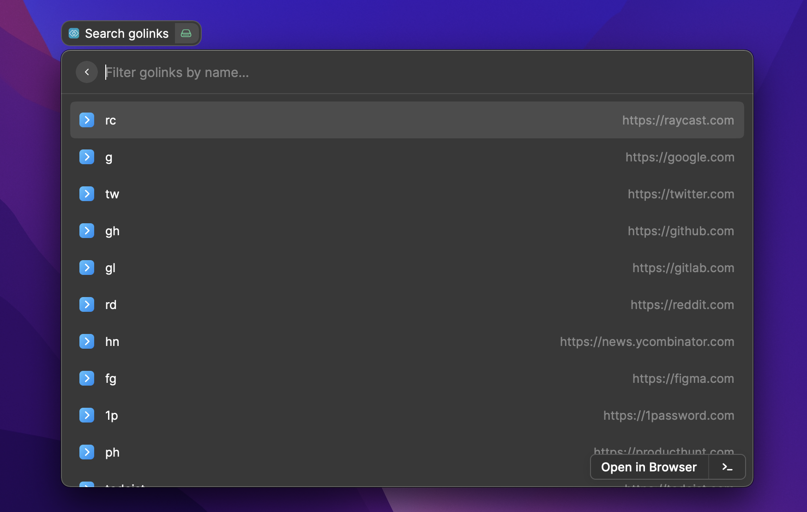
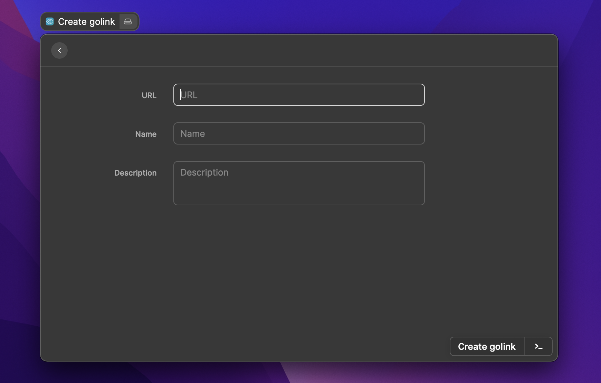

# Raycast Extension: GoLinks

A [Raycast Extension](https://developers.raycast.com) for [GoLinks](https://www.golinks.io).

## Search golinks

Lets you search golinks and then open a selected golink.

## Create golink

Lets you create a new golink.

## License

This software is released under the [MIT LICENSE](./LICENSE).
